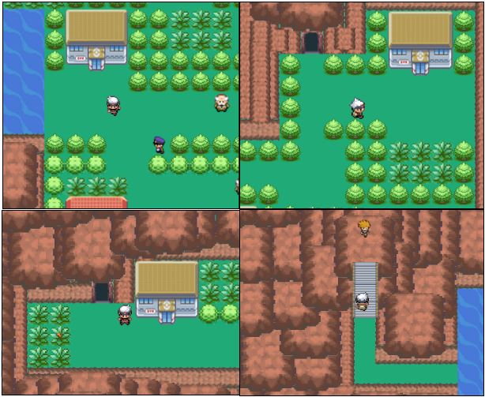
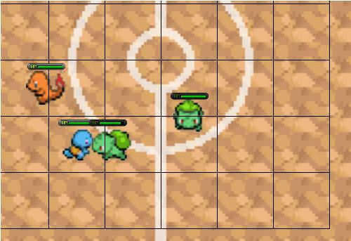
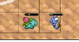
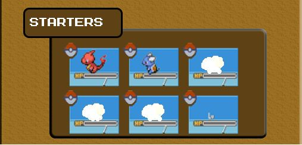
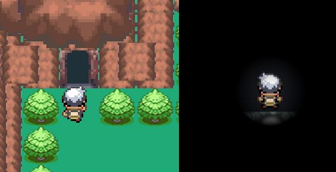
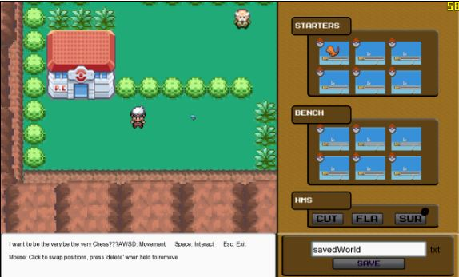
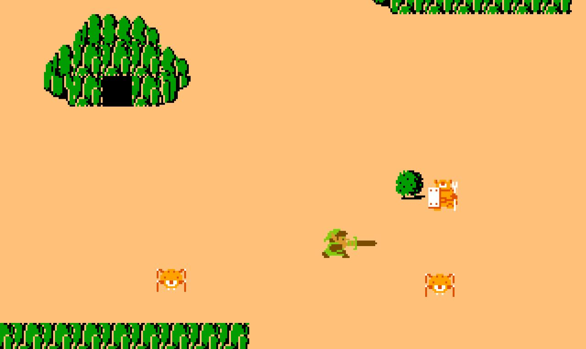
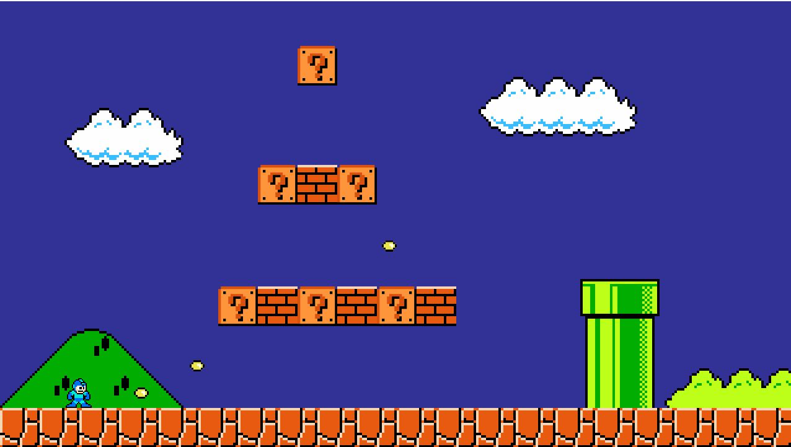
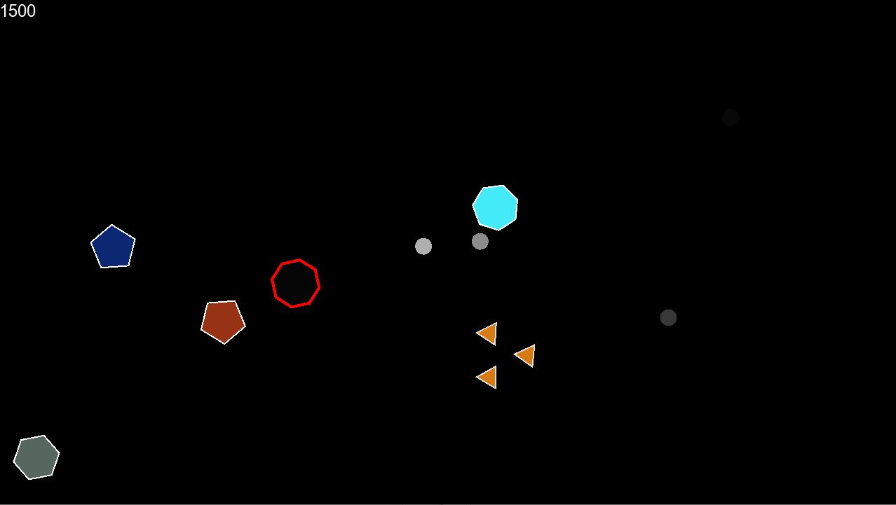

## Poke-Chess, cs 4300 final project
- ECS programming principles
- SFML c++ graphics library
# True to form overworld

# Autochess style battles!

# Custom shaders and GUI

## Previous assignments building on principles

