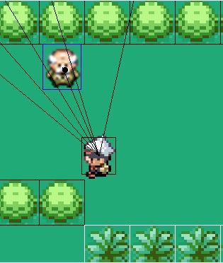

# Poke-Chess, CS 4300 final project
- ECS programming principles
- SFML c++ graphics library
## True to form overworld

## Autochess style battles!

## Custom shaders and GUI

# Previous assignments building on ECS principles
## Zelda Clone

## Megaman-Mario Mashup

## Geometric Asteriods 

### Disclaimer for educational use. We do not own rights to the sprites, audio or ip.
# SFML link to install liraries if needed
https://www.sfml-dev.org/tutorials/2.5/start-linux.php
